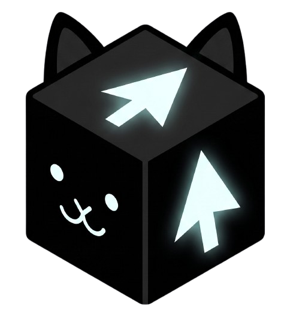

# Cursor Pet

<p align="center">
  
</p>

<p align="center">
  <strong>A living desktop cat for <a href="https://cursor.com">Cursor</a></strong><br/>
  Celebrates finished agent work · Follows your mouse · Reminds you what matters
</p>

<p align="center">
  <a href="https://github.com/vuanhtuan2000work/cursor-pet/stargazers"></a>
  <a href="./LICENSE"></a>
  <a href="#quick-start"></a>
  <a href="#quick-start"></a>
  <a href="#mcp-tools"></a>
</p>

---

## Why?

Long Cursor sessions feel empty when the agent finishes in silence. Cursor Pet puts a small companion on your desktop that reacts to what you do — without getting in the way.

| | |
|---|---|
| **Announce** | Agent stop, todo done, commit / push |
| **Chase** | Follows your cursor (toggle anytime) |
| **Remind** | Tray, chat inbox, or MCP `pet_remind` |
| **Stay out of the way** | Click-through until you point at the cat |

Local-only on `127.0.0.1` — no cloud, no telemetry.

---

## Features

- **Transparent overlay** — always-on-top, frameless, drag / double-click / roam
- **Follow cursor** — sprint after the mouse; tray toggle
- **Cursor hooks** — agent stop, `TodoWrite`, `git commit` / `git push`
- **Chat inbox** — double-click the pet (or tray → Chat inbox) for notes & quick reminders
- **i18n** — Auto from Cursor / OS locale, or force en · vi · zh · ja · ko
- **MCP tools** — agent can `pet_say`, `pet_remind`, `pet_status`
- **Git watcher** — celebrate commits outside Cursor too
- **Physics splat** — drop from high enough → puddle → pop back
- **Single tray icon** — one instance only

---

## Quick start

**Need:** Node.js **20+**, Cursor (for hooks / MCP).

```bash
git clone https://github.com/vuanhtuan2000work/cursor-pet.git
cd cursor-pet
npm install
npm run build
npm run install:hooks   # ~/.cursor/hooks.json
npm run install:mcp     # ~/.cursor/mcp.json
npm start
```

Restart Cursor once after installing hooks / MCP.

<details>
<summary><strong>Packaged builds</strong></summary>

```bash
npm run dist        # Windows portable → apps/desktop/release/
npm run dist:mac    # .dmg + .zip (build on a Mac)
```

</details>

---

## How it works

```text
Cursor hooks / MCP ──POST──► 127.0.0.1:7331 ──IPC──► Overlay pet
                                      ▲
                    Tray · Chat inbox · Git reflog watcher
```

1. Electron opens a **full-screen transparent overlay** (click-through by default).
2. A tiny **HTTP inbox** on localhost receives events from hooks and MCP.
3. The renderer runs a **PNG frame state machine** (`idle`, `walk`, `run`, `sleep`, `splat`, …) with speech bubbles.

---

## Chat inbox

Double-click the pet (or use the tray menu):

- Leave a short note → the pet acknowledges in a bubble
- Set a reminder, e.g. `remind me in 10m to review the PR`

This is a **local** inbox (notes / reminders). It does **not** replace Cursor Agent chat.

---

## MCP tools

After `npm run install:mcp`:

| Tool | Purpose |
|------|---------|
| `pet_say` | Speech bubble now (`priority: high` → excited hops) |
| `pet_remind` | Schedule a reminder (`at` = ISO, or soon) |
| `pet_status` | App running? Pending reminders? |

Example: *“When you’re done, use `pet_say` to tell me the PR is ready.”*

---

## Tray menu

Right-click the tray / menu-bar icon:

- Show / hide pet  
- Add reminder…  
- Chat inbox…  
- Watch a git repo…  
- Follow cursor · Mute · Language  
- Start with Windows / macOS  
- Quit  

**Language:** Auto (Cursor `locale.json` → OS) or lock to en / vi / zh / ja / ko.

---

## Settings

| OS | Path |
|----|------|
| Windows | `%APPDATA%/cursor-pet/settings.json` |
| macOS | `~/Library/Application Support/cursor-pet/settings.json` |

```json
{
  "port": 7331,
  "scale": 1,
  "muted": false,
  "followCursor": true,
  "locale": "auto",
  "repos": ["D:\\github\\my-repo"]
}
```

Override the port with `CURSOR_PET_PORT` (app, hooks, and MCP all honor it).

---

## HTTP API

| Endpoint | Method | Body |
|----------|--------|------|
| `/event` | POST | `{ type, title?, message, priority? }` |
| `/reminder` | POST | `{ message, at? }` |
| `/reminders` | GET | — |
| `/reminder/:id` | DELETE | — |
| `/status` | GET | — |

---

## Architecture

```text
cursor-pet/
├── apps/desktop/     Electron overlay (main + renderer + frames)
├── packages/mcp/     MCP server → localhost API
└── hooks/            Cursor hook scripts + installer
```

**Stack:** Electron · TypeScript · Cursor Hooks · MCP · Node.js

---

## macOS notes

- Lives in the menu bar + overlay (hidden from Dock)
- Visible on all Spaces and fullscreen apps
- Unsigned builds: allow once in **System Settings → Privacy & Security**
- Build packages on a Mac: `npm run dist:mac`

---

## Roadmap

- [ ] Community skins / more breeds  
- [ ] Multi-monitor aware roaming  
- [ ] Optional CI reactions (`gh pr checks`)  
- [ ] Auto-update channel  

Issues and PRs welcome.

---

<details>
<summary><strong>Tiếng Việt</strong></summary>

**Cursor Pet** là mèo desktop trên overlay trong suốt: báo khi agent xong, theo chuột, nhắc việc, chat inbox local, và nói qua MCP. Ngôn ngữ tự theo Cursor / hệ thống (hoặc chọn trong tray).

```bash
npm install && npm run build && npm run install:hooks && npm run install:mcp && npm start
```

</details>

---

## License

[MIT](./LICENSE) — use it, fork it, put a cat on every monitor.

<p align="center">
  <br/>
  <br/>
  <sub>If Cursor Pet makes your sessions a little happier, <a href="https://github.com/vuanhtuan2000work/cursor-pet">star the repo</a> ⭐</sub>
</p>
